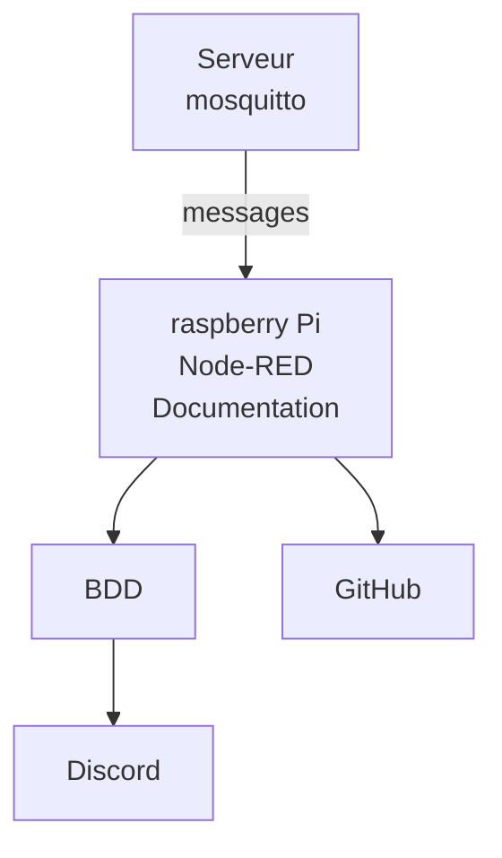
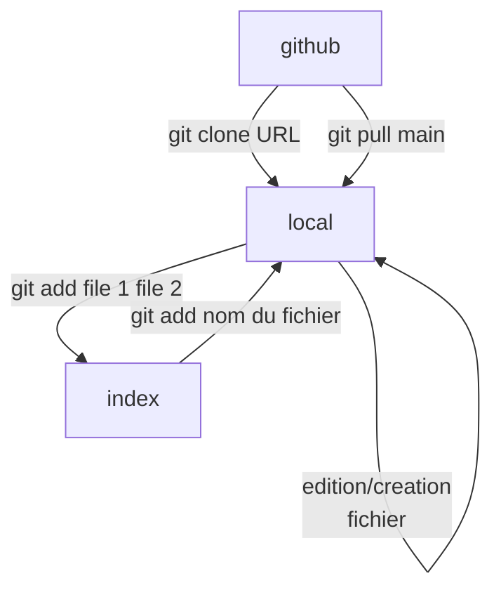

# Rapport-Projet-Ronan-Henri

Présentation de notre projet de 3ème année de BUT Mesures Physiques en Instrumentation Avancée.

Nous avons pour objectif de concevoir un système de surveillance de température en utilisant un capteur LM35, un
ESP32, un Raspberry Pi, et le protocole MQTT. Les données seront transmises au Raspberry Pi
via Mosquitto, stockées dans une base de données SQLite, et affichées en temps réel via Node-
RED.

